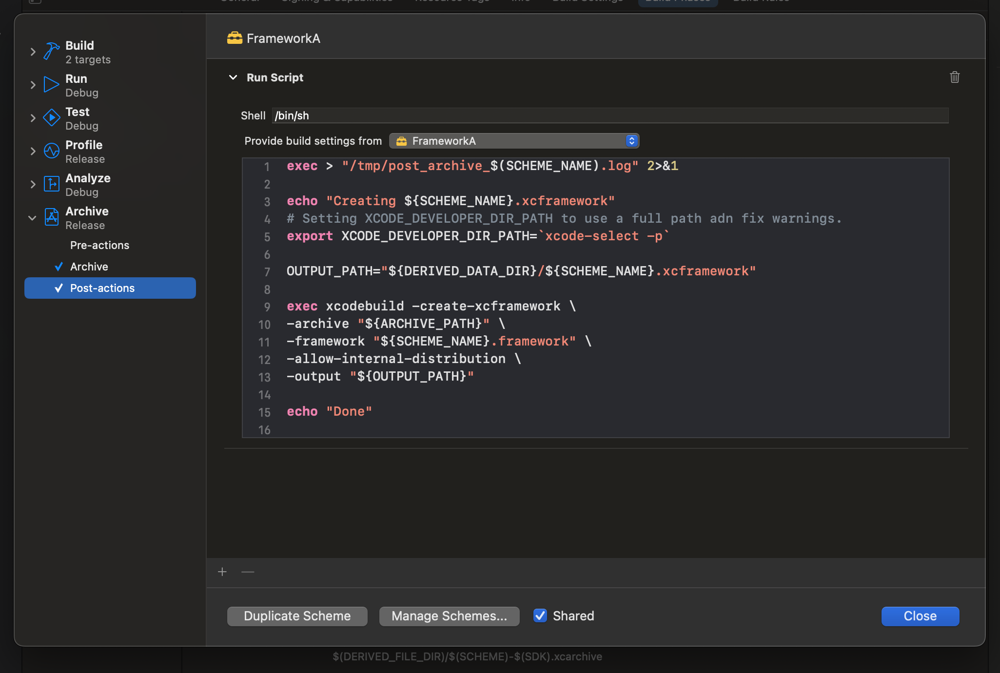

[![Swift Version][swift-image]][swift-url]
[![LICENSE][license-image]][license-url]

# Product Name
<br />
<p align="center">
  <a href="https://github.com/chris-grantham/WorkspaceXCFrameworkSpike">
    <h3><Spike Workspace for iOS app using XCFrameworks & Swift Packages/h3>
  </a>
  <p align="center">
    Demonstrates how to integrate XCFrameworks and Swift Packages in an application as part of an XCWorkspace.
  </p>
</p>

<p align="row">

</p>

## Features

- [x] FrameworkA encapsulates FrameworkB as a wrapper
- [x] Package-FrameworkA exposes FrameworkA as a Swift Package
- [x] PackageConsumerApp demonstrates use of the Swift Package for FrameworkA
- [x] XCFrameworkConsumerApp demonstrates use of XCFramework for FrameworkA
- [x] Automation provided by scripts (post-archive action and build-phase).

## Requirements

- iOS 16.4+
- Xcode 15.0

## Installation

- Archives and XCFrameworks for FrameworkA and FrameworkB can be generated by selected the appropriate scheme and using the Archive task in Xcode, this will trigger a post-archive run-script to generate the relevant XCFramework.

You can observe how the consumer apps(s) import `FrameworkA` from either the XCFramework or the Swift Package:

``` swift
import Foundation
import FrameworkA
```

## Meta

Christopher Grantham – [Twitter/X](https://x.com/cgrantham-dev) - [LinkedIn](https://www.linkedin.com/in/chris-grantham)

Distributed under the APACHE LICENSE, VERSION 2.0. See ``LICENSE`` for more information.

[https://github.com/chris-grantham/](https://github.com/chris-grantham/)

[swift-image]:https://img.shields.io/badge/swift-5.0-orange.svg
[swift-url]: https://swift.org/
[license-image]: https://img.shields.io/badge/License-MIT-blue.svg
[license-url]: https://opensource.org/licenses/Apache-2.0
